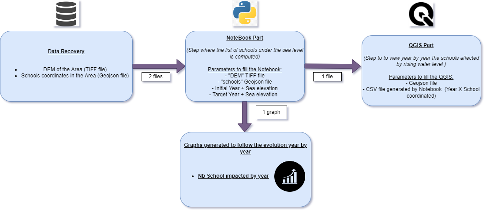

# ClaraVista's solution for the 2022 Hackathon IIEP-UNESCO

This repository contains the code submitted by the ClaraVista team for the 2022 edition of the IIEP-UNESCO Hackathon.
The challenge we tried to solved is the challenge number 2, described [here](https://box.iiep.unesco.org/s/YxZiiATTsAsbyMK/download/Hacking%20EDplanning_Challenge%202%20brief.pdf).

More documentation can be found in the following links:
- complete challenge documentation: https://box.iiep.unesco.org/s/YxZiiATTsAsbyMK/download/Hacking%20EDplanning_Challenge%202%20brief.pdf
- Github's deposit of the challenge: https://github.com/iiepdev/HackingEDPlanningV2-Challenge2

## Objective

Our solution computes a list of all the schools endangered by the sea level rise caused by global warming in a given patch of land. In order to do that, it needs the following data:
- a Digital Elevation Model (DEM) of the considered land,
- the coordinates of the schools considered, preferably located in the considered land (otherwise this solution would not be very useful !),
- a prediction of the sea level elevation at a given date along with the elevation at the current date.

With such a data, our solution can compute the list of schools among the provided ones that will be endangered by the specified sea level rise. We compute the following visualizations to illustrate this:
- a bar chart of the number of endangered schools per year,
- a temporal animation in QGIS, showing the endangered schools year by year in the considered land.

The following diagram illustrates our procedure:

We invite you to read the [user guide](user_guide.pdf) for more information on how to generate the data and perform the necessary operations in order to obtain the visualizations.

## Description

This deposit should be self-sufficient and contain all the necessary documentation for you to understand what we did during this challenge. It is composed by the following files and folders:
- [user guide](user_guide.pdf): the user documentation describing the process we followed. It describe amongst others the process you can follow to generate the necessary data for the computations. All the data used for this challenge are open-source and available freely on the internet. This user guide also describe the manipulation you can perform with [QGIS](https://www.qgis.org/fr/site/) in order to compute the temporal animation.
- [computation notebook](computations.ipynb): the python implementation of the computations. Once you have generated the necessary data (you can also choose to use the provided one if you simply want to fiddle with the code), head to this notebook to perform the computation and see the visualizations.
- [data folder](data): a folder containing pre-generated DEM and school data, in a patch of land in Bangladesh.
- [output folder](output): a previously generated output folder containing the outputs of the computations of the data in the [data](data) folder. By default, the [computation notebook](computations.ipynb) writes its results in this folder.
